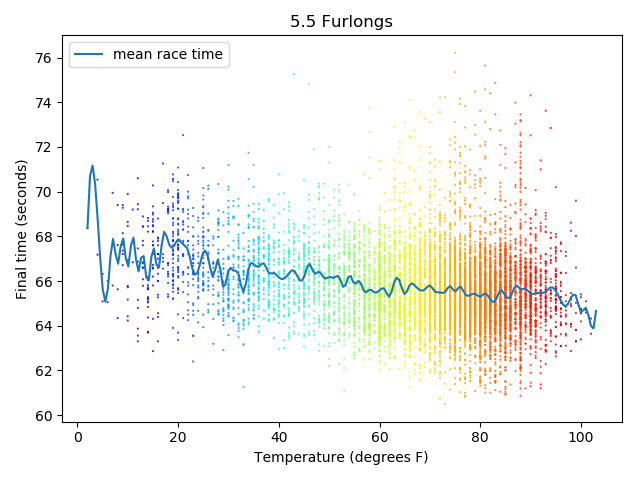
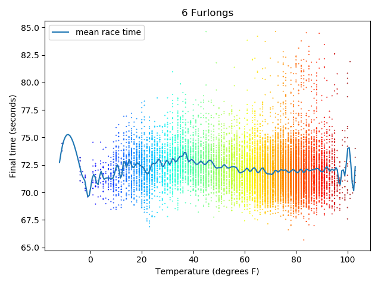
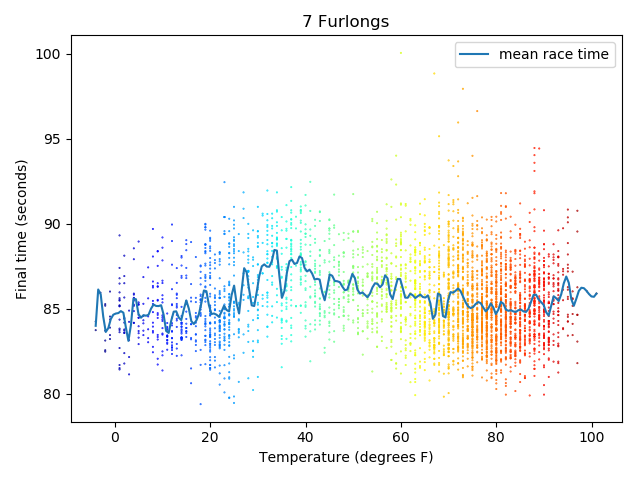

# Code Louisville Python for Data Project

## TL;DR

Running `main.py` will process files in the `data` subdirectory and store them in various tables in a mySQL database.
It will then pull information from the database about how long it took horses to complete races of various lengths
and what the temperature was for each of those races. It will then generate a plots for each race length showing the 
final times against  the temperature of the race as well as line showing the mean race times at each temperature.
A few outliers and bonkers-looking values (such as final race times of 0 seconds and temperatures about 130 degrees) 
are taken out of the data. The output plots will be placed in an image file called `race_times_vs_temperature.png`, which will be located
 in the program's root directory. 

## Setup requirements.

In addition to cloning this repo to your local machine, you'll need to download the zipped data file 
[here](http://www.JonKPowers/horse_data.zip) and extract it into a data subdirectory at `/path_to_repo/data/`. 
The repo's root directory should contain files like `main.py` and `database_functions.py`, and the `data` directory
should contain 8000-9000 files, mostly having a `.1` extension.  

To run `main.py` and its related scripts, your environment must have the following packages installed and available (most current versions should work fine):
* PyMySQL
* numpy
* pandas
* matplotlib
* python-dateutil

Finally, the database functions expect to find a mySQL server listening on `localhost`.
It will need to be configured with a user whose username is `codelou` and whose password is `ABCabc123!`
If needed, a different username and password can be used by editing both of the following:
* `DbHandler.__init__()` in `db_functions.py`: `username` and `password` arguments
* `QueryDb.__init__()` in `aggregation_functions.py`: `username` and `password` arguments

The user `codelou` will need full permissions on horse-related databases along the lines of 
`GRANT ALL PRIVILEGES ON horses%.* TO 'codelou'@'localhost'`.

## The Problem

There isn't really a problem that's being solved here--this goal of project was primarily to clean the data and organize
it in a way that it can be used in some future machine learning projects to develop a model that tries to predict 
outcomes of individual horse races. As described in more detail below, the data is pretty wide 
and needed a lot of TLC to be made suitable for use.

... but for purposes of the CL project, I was curious about whether there is any correlation between the temperature 
during a race and the final time of the race. My hypothesis was that races run when it is very hot would be relatively
slower than races run at more pleasant temperatures. This made intuitive sense to me that it would be harder to perform
a vigorous activity like running when it's hot than when it's cool. 

As it turns out, I was generally wrong: There doesn't seem to be any general pattern of cooler temperatures resulting in
faster final times. If anything, the mean final times generally seem to be faster at higher temperatures, particularly
with shorter race distances. That said, the slow outlier times do tend to show up more frequently at the high 
temperatures, but this could be for any number of reasons not directly related to the temperature. One interesting feature
in the visualization is there seems to be a band of moderate temperatures [______________] that are producing times that
tend to be a little slower than at extreme cold or hot temperatures. One possible explanation for this is that many
breeding and training operations are either in Canada (with generally cold temperatures) or in the southern United States
(with generally hot temperatures). As a result, particular horses may be predisposed or trained to work in either a 
particularly warm or particularly cool climate and gives its best performances there rather than in more moderate climates.  

## The Data

The data used in this project are from [Brisnet](http://www.brisnet.com), an online horse-handicapping resource site.
Because the data is not made available freely, [___________________]. 

There are two main formats of data that can be processed by this scipt. The first are general race results, 
which provide information regarding races that have been run, including race conditions, distance, etc., 
the horses that ran, how quickly each horse completed the race, and other details about the race. It provides very granular
data on a number of aspects of the race. The second main format of data is known as past performance information.
This information is made available before a particular race is run and is what horse handicappers scour when trying to 
predict what horses will finish first in that race. It provides some general information about the race that is going 
to be run, but its primary purpose is to provide information about how each horse has run in previous appearances.
So for each horse that is going to be in the race, the past performances data will tell us about the last 10 races 
that horse has run and how that horse did in the race. This allows us to get a general sense of how quickly the horse
ran and how tough the competition was. The downside is that the detail provided about past races isn't as rich as what
we get from the results data.

The race results data is composed of 283 columns, which is spread over 6 files. The past performance data is composed of
1,435 columns, all of which is contained in a single file. Because each file has a different columns structure 
and presents unique challenges, processing is specific to the type of file. 

The detailed file structure for the race results can be found [here](http://www.brisnet.com/library/newchart2.txt), 
and details for the past performance data is [here](http://www.brisnet.com/cgi-bin/static.cgi?page=drfsff). 
All the raw source files are in csv format.

[INSERT INFO ABOUT NUMBER OF FILES/RECORDS/RACES]

## Overview of program logic

The big-picture program flow is handled by main, and specific functions and routines are contained in other files
solely for ease of reading and editing. By default, `main()` will process all files contained in the `data` subdirectory below `main.py`. 
It can also process individual files when used interactively.

Due to the 65,535-byte row-size limitation of mySQL, it was not possible to store all ~1400 columns of data from the 
past-performance data in a single database. This required me to spread this data over several tables, which I've
generally organized around single topics of interest, such as the general race infomation (race class, entry requirements,
racing surface info, etc.), horse performances, trainer and jockey information, etc. This is implemented in 
`main()` by spinning up a `TableHandler` object for each table. The structure for each table is defined by a dict, which
is parsed by the TableHandler to initialize the table and set databse constraints. The `TableHander` also mediates
interactions between the program and the database handler when seeding the database. 

Next, `main()` begins processing files. By default it will process all files contained in the `/data` directory except
files that contain an unsupported file extension (which are skipped and left alone). If it appears that a file has
already been processed, the program will ask the user how to proceed. The csv first read into a pandas 
`DataFrame`, which is then modified by `tidy_it_up()` and `add_features()`. There were two pervasive problems in this data. One was that a large number of datapoints
are simply binary True/False flags, but they are coded using various letters, such as 'c' if the race utilized a chute
start and blank if not; or it might use 'S' to indicate that a race is a statebred-only race and blank otherwise.
`tidy_it_up()` modifies the table to use 1s and 0s to replace all of the varied flag indicators. 

The second major issue in the data is the use of a single column to represent more than one variable. 
This was particularly prevalent in items related to medications, racing equipment, and age/sex restrictions. For
example, the age and sex restrictions on a race are contained in a single column and consist of a three-letter code.
The first two letters provide data on the ages allowed in the race while the third letter provided data on which sexes
were allowed. As a result, both an age limitation (such as only three-year olds) and a sex restriction (fillies only)
would be represented by the single-column entry 'BOF'. It's a similar story with several other fields. 

Another case where data was buried inside a single column is the race restrictions. Traditionally, race restrictions are
given as a shorthand abbreviation such as Alw31000n2x, which describes a $31,000 allowance race for horses that have
never won two races or that meet some other exception. The 'x' in the code tells us that there are some exceptions but 
doesn't tell us what those exceptions are or how many there are). However, a full description of the race conditions is 
provided in the data as prose text. `add_features()` contains routines to parse through that text to pull out the full 
details about the race restrictions as well as other information contained in the text, like temporary rail 
distances, how much weight the horse must carry, purse amount, etc.

Once the `DataFrame` goes through these processing steps, it is then run through each `TableHandler`. 
These will only process the `DataFrame` if the source filetype is associated with its table. 
It extracts the data relevant to the table from the `DataFrame` and adds those records to the database. 
Uniqueness contraints built into the database schema should prevent any duplicate records from being added. 

Finally, after all of this processing is complete, the relevant source file is moved into a new subdirectory of `/data` 
based on its file extension. 

  